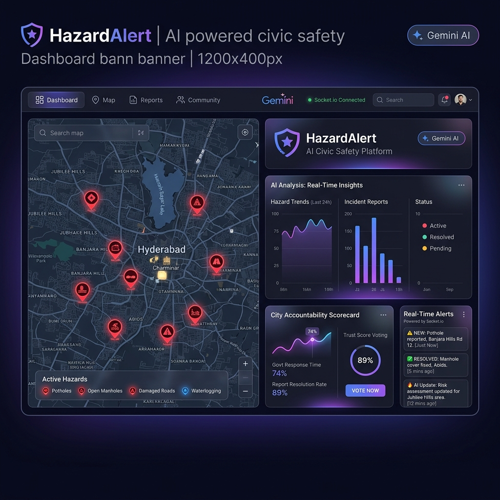
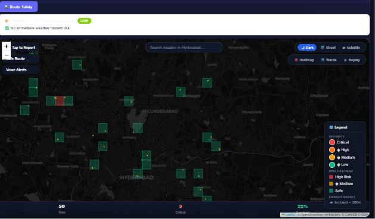
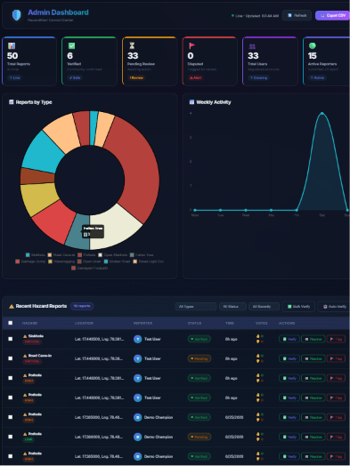
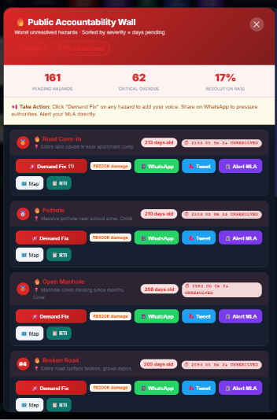
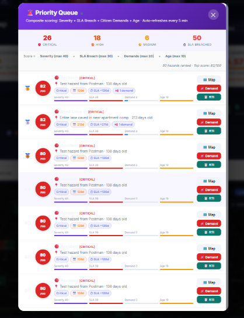
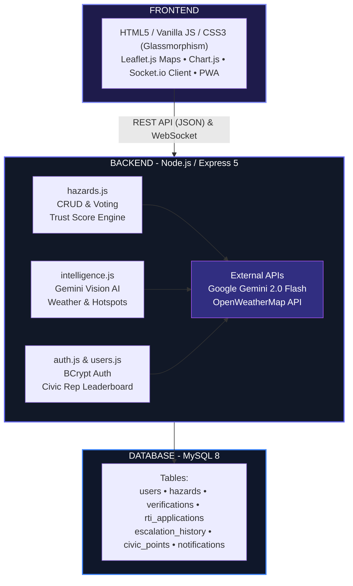
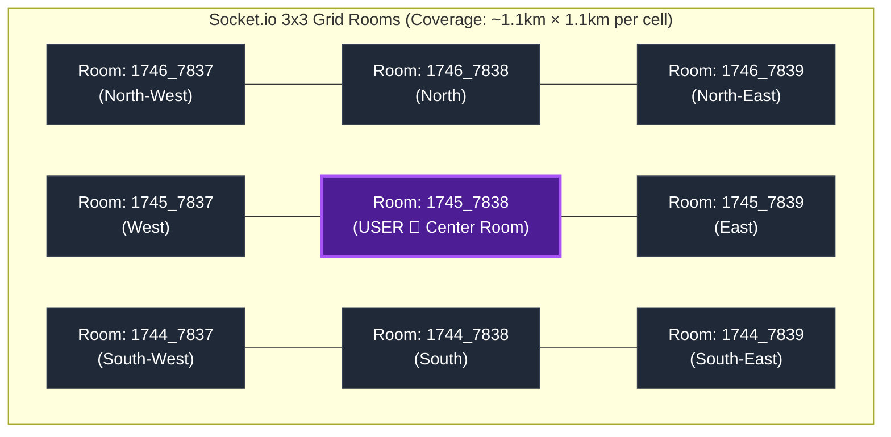

<p align="center">
  
</p>

<h1 align="center">🚧 HazardAlert — AI Civic Accountability Engine</h1>

<p align="center">
  <strong>India's first AI-powered road safety & civic accountability platform</strong><br/>
  Real-time hazard reporting • Gemini Vision AI analysis • Community trust scoring • Government accountability tracking
</p>

<p align="center">
  
  
  
  
  
  
  
</p>

---

## 📋 Table of Contents

- [Problem Statement](#-problem-statement)
- [Solution](#-solution)
- [Screenshots](#-screenshots)
- [Key Features](#-key-features)
- [Tech Architecture](#-tech-architecture)
- [Installation & Setup](#-installation--setup)
- [API Endpoints](#-api-endpoints)
- [How It Works](#-how-it-works)
- [Project Structure](#-project-structure)
- [Testing](#-testing)

---

## 🎯 Problem Statement

Indian cities face **thousands of unreported road hazards** — potholes, open manholes, waterlogging — that cause **~1.5 lakh accidents annually**. Citizens report issues but:

- ❌ No way to verify if reports are genuine
- ❌ No real-time alerts for nearby dangers
- ❌ No government accountability tracking
- ❌ No data-driven pressure for faster fixes

## 💡 Solution

**HazardAlert** is a full-stack civic-tech platform that uses **AI photo analysis**, **real-time WebSocket alerts**, and **community trust scoring** to create a transparent, verifiable hazard reporting system targeting GHMC Hyderabad.

---

## 📸 Screenshots

<p align="center">
  <strong>1. Interactive Live Hazard Map Dashboard</strong>
  <br/>
  
</p>

<br/>

<p align="center">
  <strong>2. Real-Time Proximity Alerts & Verification Feed</strong>
  <br/>
  
</p>

<br/>

<p align="center">
  <strong>3. Ward-Wise Government Shame Board</strong>
  <br/>
  
</p>

<br/>

<p align="center">
  <strong>4. AI-Weighted Priority Queue Engine</strong>
  <br/>
  
</p>

---

## ✨ Key Features

### 🧠 AI-Powered Hazard Analysis (Gemini Vision)
- Upload a photo → Gemini 2.0 Flash analyzes it in real-time
- Classifies into **12 hazard types** (Pothole, Open Manhole, Road Cave-in, etc.)
- Assigns severity (low/medium/high/critical) with confidence score
- **Strict rejection** of fake/irrelevant images (green screens, selfies, indoor photos)
- Keyword-based fallback when API quota is exhausted

### ⚡ Real-Time Proximity Alerts (Socket.io)
- GPS-based **grid zone architecture** (~1.1km cells)
- Each user joins **9 rooms** (3×3 grid) for seamless coverage
- New hazard reports broadcast **instantly** to all nearby users
- Sliding banner alerts with Confirm/Dispute buttons

### 🗳️ Community Trust Scoring & Voting
- Weighted voting system: Photo proof (+4), Video proof (+5), Confirm (+2), Reject (-3)
- **Trust Score** = weighted sum / (votes × max weight) → 0-100%
- Auto-verified at **>75%**, marked false at **<30%**
- Troll-resistant: evidence outweighs empty rejections

### 🏛️ Government Accountability Engine
- **Accountability Score**: Tracks GHMC response time, resolution rate
- **Shame Board**: Public leaderboard of worst-performing wards
- **Auto-Escalation**: Unresolved hazards escalate at 7 → 15 → 30 days
- **Economic Damage Estimation**: Calculates ₹ cost of unrepaired hazards

### 📝 RTI Auto-Filing System
- One-click RTI (Right to Information) application generation
- Pre-filled with hazard data, location, and timestamps
- Email integration with GHMC officials

### 🌍 Additional Features
- **Multi-language support** (English, Hindi, Telugu)
- **Dark mode** glassmorphism UI with premium design
- **Voice Alerts** for hands-free driving notifications
- **Safe Route** planner avoiding hazard-dense areas
- **Priority Queue** with AI-weighted hazard ranking
- **QR Code** sticker generation for physical hazard marking
- **Weather Risk** alerts integration (OpenWeatherMap)
- **PWA Support** — installable as mobile app
- **Ward-wise heatmaps** with risk visualization

---

## 🏗️ Tech Architecture



### Socket.io Grid Zone Architecture



Each cell represents approximately `1.1km × 1.1km` geographical area. Upon connection, the user joins 9 neighbouring rooms to guarantee complete proximity safety warnings.

---

---

## 🚀 Installation & Setup

### Prerequisites
- **Node.js** ≥ 18.0.0
- **MySQL** 8.0+
- **Gemini API Key** (free from [Google AI Studio](https://aistudio.google.com/apikey))

### 1. Clone the repository
```bash
git clone https://github.com/YOUR_USERNAME/hazardalert.git
cd hazardalert
```

### 2. Install dependencies
```bash
cd backend
npm install
```

### 3. Configure environment
```bash
cp .env.example .env
```
Edit `.env` with your credentials:
```env
DB_HOST=localhost
DB_USER=root
DB_PASSWORD=your_mysql_password
DB_NAME=hazard_reporting_db
DB_PORT=3306

GEMINI_API_KEY=your_gemini_api_key
OPENWEATHER_API_KEY=your_openweather_key
```

### 4. Set up the database
```bash
# Create database in MySQL
mysql -u root -p -e "CREATE DATABASE IF NOT EXISTS hazard_reporting_db"

# Run migrations
npm run migrate

# Seed demo data (optional)
npm run seed
```

### 5. Start the server
```bash
npm start
# or for development with auto-reload:
npm run dev
```

### 6. Open in browser
```
http://localhost:5000
```

---

## 📡 API Endpoints

### Authentication
| Method | Endpoint | Description |
|--------|----------|-------------|
| POST | `/api/auth/register` | Register new user |
| POST | `/api/auth/login` | Login with email/password |

### Hazard Reporting
| Method | Endpoint | Description |
|--------|----------|-------------|
| GET | `/api/hazards` | List all hazards (with filters) |
| POST | `/api/hazards` | Submit a new hazard report |
| GET | `/api/hazards/:id` | Get hazard details |
| POST | `/api/hazards/:id/verify` | Vote on a hazard (confirm/reject) |
| GET | `/api/hazards/:id/trust-score` | Get current trust score |
| GET | `/api/hazards/nearby` | Get hazards within radius |
| GET | `/api/hazards/risk-zones` | Get hazard density zones |

### AI Intelligence
| Method | Endpoint | Description |
|--------|----------|-------------|
| POST | `/api/intelligence/analyze-photo` | AI photo analysis (Gemini Vision) |
| GET | `/api/intelligence/weather-risk` | Weather-based risk alerts |
| GET | `/api/intelligence/predictive-hotspots` | AI hotspot prediction |
| GET | `/api/intelligence/accountability-score` | Govt accountability metrics |

### Users
| Method | Endpoint | Description |
|--------|----------|-------------|
| GET | `/api/users/:id/profile` | User profile with civic score |
| GET | `/api/users/leaderboard` | Top civic contributors |

---

## ⚙️ How It Works

### Trust Score Algorithm
```
For each vote on a hazard:
  - Confirm           → +2 points
  - Confirm + Photo   → +4 points  (2 base + 2 photo bonus)
  - Confirm + Video   → +5 points  (2 base + 3 video bonus)
  - Confirm + Both    → +7 points  (2 + 2 + 3)
  - Reject            → -3 points

Trust Score = (Weighted Sum) / (Total Votes × Max Weight per Vote)

Status Rules:
  Score > 75%  →  ✅ Verified (auto-promoted)
  Score < 30%  →  ❌ False Report (auto-demoted)
  Otherwise    →  ⏳ Pending
```

### Real-Time Alert Flow
```
1. User opens app → Browser sends GPS to server
2. Server calculates grid zone (lat/100, lng/100)
3. User joins 9 Socket.io rooms (3×3 grid around their zone)
4. Someone reports a hazard nearby → Server emits to zone rooms
5. All users in those rooms receive instant alert banner
6. User can Confirm or Dispute from the alert itself
```

---

## 📁 Project Structure

```
hazardalert/
├── backend/
│   ├── server.js                 # Express + Socket.io server
│   ├── db-config.js              # MySQL connection pool
│   ├── routes/
│   │   ├── hazards.js            # CRUD, voting, trust scoring
│   │   ├── intelligence.js       # Gemini AI, weather, predictions
│   │   ├── auth.js               # Registration & login
│   │   └── users.js              # Profiles & leaderboard
│   ├── run_migration.js          # Database schema migrations
│   ├── seed_demo.js              # Demo data seeder
│   ├── .env.example              # Environment template
│   └── package.json
│
├── frontend/
│   ├── index.html                # Single-page application
│   ├── style.css                 # Glassmorphism design system
│   ├── app.js                    # Main application logic
│   ├── mapp.js                   # Leaflet map integration
│   ├── i18n.js                   # Multi-language (EN/HI/TE)
│   ├── civic_trust.js            # Trust scoring UI
│   ├── priority_engine.js        # Priority queue system
│   ├── pressure_engine.js        # Public pressure campaigns
│   ├── rti_engine.js             # RTI auto-filing
│   ├── profile.js                # User profiles & gamification
│   ├── unique_features.js        # Shame board, QR codes
│   ├── service-worker.js         # PWA offline support
│   └── manifest.json             # PWA manifest
│
├── docs/
│   └── banner.png
├── .gitignore
└── README.md
```

---

## 🧪 Testing

### Run the full E2E test suite
```bash
cd backend
node complete_verification.js
```

### Test Socket.io + Voting live demo
```bash
node live_demo_socketio.js
```

### Test AI accuracy
```bash
node test_ai_accuracy.js
```

### Verified Test Results
| System | Status | Details |
|--------|--------|---------|
| Socket.io Alerts | ✅ Working | Sub-second delivery to grid zones |
| Voting System | ✅ Working | Weighted votes stored in MySQL |
| Trust Score Math | ✅ Working | 60% → 85% → 46.7% as expected |
| Auto-Verification | ✅ Working | Status changes at >75% threshold |
| Troll Resistance | ✅ Working | Evidence outweighs empty rejects |
| Gemini Vision AI | ✅ Working | 12 hazard types, strict rejection |
| Keyword Fallback | ✅ 80% accuracy | 8/10 types classified correctly |
| Image Rejection | ✅ 100% accuracy | Blocks fake/blank/small images |

---

## 🛣️ Future Roadmap

- [ ] Mobile app (React Native / Flutter)
- [ ] GHMC official API integration
- [ ] ML-based hazard severity prediction from historical data
- [ ] Blockchain-based immutable report ledger
- [ ] WhatsApp Bot for hazard reporting
- [ ] Integration with Google Maps for route warnings

---

## 👨‍💻 Author

Built as a civic-tech initiative targeting GHMC Hyderabad road safety.

---

## 📄 License

ISC License

---

<p align="center">
  <strong>⭐ Star this repo if you believe in safer roads for India! ⭐</strong>
</p>
